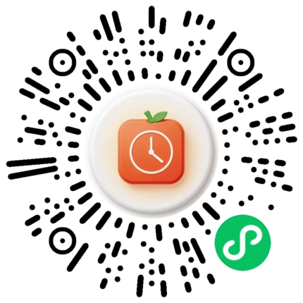

# 番茄心流 (MindPomo)

> 专注是一种修行

一款简洁优雅的番茄工作法计时器小程序，帮助你在工作和学习中保持专注。


## 功能特性

- **标准番茄工作法** - 25分钟专注 + 5分钟短休息，每4个周期后长休息
- **标签分类** - 为每次专注会话添加标签（如学习、工作、阅读）
- **统计数据** - 记录每日专注次数和时长，查看历史数据
- **灵活设置** - 自定义专注/休息时长，通知方式
- **多渠道通知** - 振动、声音提醒、完成自动通知

## 项目结构

```
mindpomo/
├── app.js       # 小程序入口
├── app.json    # 小程序配置
├── app.wxss    # 全局样式
├── audio/      # 提示音资源
├── components/ # 组件
│   └── tag-picker/  # 标签选择器
├── images/     # 图片资源
├── pages/      # 页面
│   └── index/ # 专注主页
│   └── stats/  # 统计页面
│   └── settings/ # 设置页面
└── utils/      # 工具函数
    └── notification.js # 通知
    └── storage.js   # 存储
    └── time.js     # 时间
```

## 微信扫码使用



扫描上方小程序码即可体验「番茄心流」

### 开发者预览

1. 下载 [微信开发者工具](https://developers.weixin.qq.com/miniprogram/dev/devtools/download.html)
2. 导入项目目录
3. 使用测试号预览

## 使用指南

1. **开始专注**: 点击首页"开始"，选择标签后开始计时
2. **暂停/恢复**: 可在专注过程中暂停和恢复
3. **结束会话**: 会话完成后自动保存，也可提前结束
4. **查看统计**: 切换到"统计"标签页查看专注数据
5. **调整设置**: 切换到"设置"自定义时长和通知方式

## 技术栈

- **框架**: 原生微信小程序
- **存储**: 本地存储 (wx.setStorage)
- **API**: wx.notifyTablet、wx.vibrateShort 等

## License

MIT License - 开放开源，欢迎贡献

---

<p align="center">Made with love for focus</p>